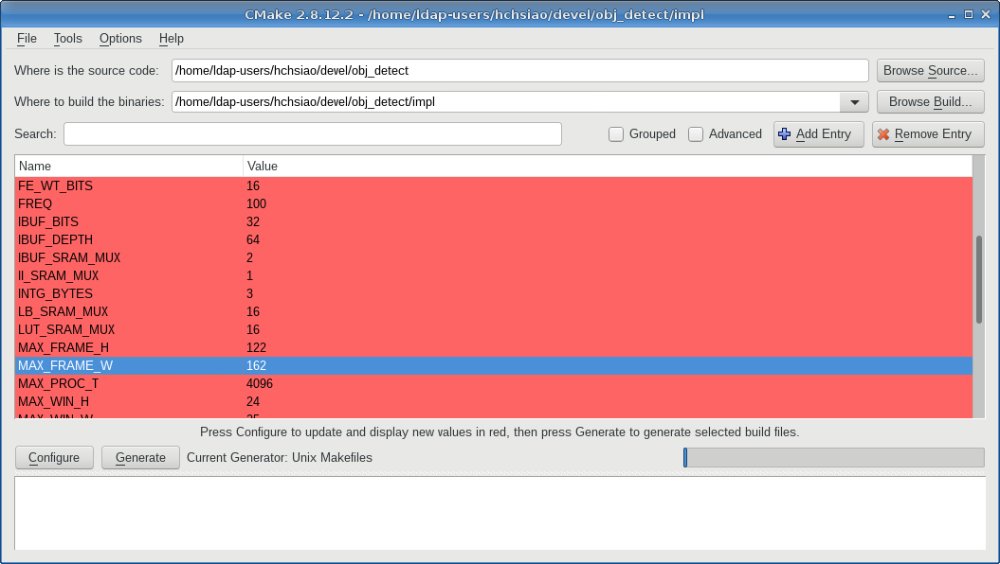

# ChipCMake
An EDA framework for pre-silicon/FPGA projects based on cmake and SystemVerilog.

## Design goals
### Features
- Vendor-independent
  - Interface to different tools can be decoupled from the build system by creating seperate cmake modules.
- Platform-independent
  - Using the neat `find_package` feature from cmake, EDA tools with different versions and installations across workstations can be handled.
- Techonology-independent
  - Different processes (e.g. UMC 90nm, TSMC 65nm)
  - FPGA devices
- Automate various repetitive (and error-prone) stuff in the traditional flow

### Role
- Package (a.k.a. IP) manage system
  - take advantage from the git submodule mechanism to manage sub-designs, each project can point its IP to any branch and version
  - SystemVerilog package as namespace
  - parameters are propergated from
- Build system
  - pre-processing, IP configuration, run synthesis, run P&R
- Unit testing (a.k.a. functional verification) framework
  - run simulation, formal verification, static analysis (e.g. linting, STA), create debug session (e.g. waveform, temporal-flow view)

## Files
Typical directory structure for a project named `<PROJECT_NAME>`:
```
<PROJECT_ROOT>/
├── ip/  
│   ├── <SOME_IP>/  
│   └── <ANOTHER_IP>/  
├── src/  
│   ├── hdl/  
│   │   ├── <SOME_MODULE>.sv  
│   │   └── <ANOTHER_MODULE>.sv  
│   └── sw/  
│       └── <THE_DRIVER>.c  
├── test/  
│   ├── ip/  
│   │   └── <SOME_VIP>/  
│   ├── CMakeLists.txt  
│   └── bench.sv  
├── <PROJECT_NAME>_config.svh.in  
├── <PROJECT_NAME>_config.h.in  
├── CMakeLists.txt  
└── config.cmake  
```

#### CMakeLists.txt
The root cmake script to build the project. Will be invoked as in-context project (as an IP) or out-of-context (as the top-level design).

#### config.cmake
Parameters for the project when used as the top-level design.
The parameters will be inferred from its parent's configuration when used as an IP, hence this file is not used for in-context builds.

#### test/CMakeLists.txt
Configuration scripts and dependencies for simulation only IP will be described in this file.

#### \<PROJECT_NAME\>\_config.\*.in
Templates for header files with hard-coded parameters (i.e. configurations). ChipCMake will calculate these variable constants during configuration.

## Installation
Make sure `ChipCMake.cmake` can be found by cmake `include()`, see the [cmake](https://cmake.org/cmake/help/v3.0/command/include.html) document.

## Usage
### Project creation
 - Create a `CMakeLists.txt` as a usual cmake project.
 - Include ChipCMake

```cmake
include(ChipCMake)
```

 - Specify tools required for implementation, for example:

```cmake
# The Find${EDAToolName}.cmake could be shipped with ChipCMake or using the customized one
find_package(DesignCompiler) # If Synopsys synthesis tool is required
find_package(EDI) # If Cadence APR tool is required
```

 - Declare configurable parameters if there are any (without specifying defaults)

```cmake
# Note this is not cmake built-in
configure_parameters(
  <PARAM1_NAME>
  <PARAM2_NAME>
  ...
)
```

 - Generate configuration files (\*.in) with cmake built-in function

```cmake
configure_file(${PROJECT_NAME}_config.svh.in ${PROJECT_NAME}_config.svh)
```

 - Specify sources

```cmake
file(GLOB_RECURSE design_sources src/hdl/*.sv)
file(GLOB_RECURSE design_headers src/hdl/*.svh)
specify_design(SOURCES ${CMAKE_CURRENT_BINARY_DIR}/${PROJECT_NAME}_config.svh ${design_headers} ${design_sources})
```

 - Specify search path for include files and IP, and the test directory. The test and IP path is often fixed, as the Files section states.

```cmake
hdl_include_directories(
  ${CMAKE_CURRENT_BINARY_DIR} # For configuration files
  ${CMAKE_CURRENT_SOURCE_DIR}/src/hdl # For other hdl headers
)
ip_directories(ip test/ip)
# Add your design IP here
# ...
add_testbench_subdirectory(test)
```

 - Add flow to the make rules, to allow commands like `make presim_for_test` or `make synth_for_demo`. There are no rules to the name of rules.

```cmake
add_synth_target(my_synth
  TOP ${CMAKE_PROJECT_NAME}
  )
add_impl_target(my_impl)
```

 - (Optional) If the implementation requires pre-processing (e.g. explore the SRAM design space and select the optimal specification for the memory generator), add the pre-processing rule (may be to run a python script) as a dependency

```cmake
add_dependencies(my_synth sram_preproc) # stating that "my_synth depends on sram_preproc", see cmake document for details
```

### Tests creation
 - Create a `CMakeLists.txt` in the sub-directory `test/`.
 - Include ChipCMake and packages for simulation

```cmake
include(ChipCMake)
find_package(VCS REQUIRED)
```

 - Specify test sources (test fixture, test cases) and IP involved (including all design IP and VIP)

```cmake
file(GLOB test_sources *.sv)
add_testbench(presim ${test_sources}
  IP_LIST
    ${IP1_NAME}
    ${IP2_NAME}
  FLAGS ${VCS_FLAGS}
  )
```

 - (Optional) If the test-pattern requires pre-processing (e.g. generate a random pattern with a distribution SystemVerilog do not support), add the pre-processing rule (may be to run a python script) as a dependency

```cmake
add_dependencies(presim my_rand_gen) # stating that "presim depends on my_rand_gen", see cmake document for details
```

### Adding IP
Add the IP repository as a submodule
```sh
git submodule init # if not done yet
git submodule add $IP_REPO_URL ip/my_ip
```

In the root CMakeFileList.txt, add:
```cmake
add_ip(my_ip
  SOME_PARAM 10
  ANOTHER_PARAM "True"
  )
```

### Configuration
All parameters should be written in `config.cmake`.
Modify this file with a text editor to meet the project requirement.

Alternatively, one could also make use of the `cmake-gui` feature, as ChipCMake is based on cmake.


### Run
 - Initialize (configure) the project for implementation and simulation
```sh
mkdir -p impl # could also be 'build' or else, the name is not relevant
cd impl/
cmake -C ../config.cmake .. # initialize ChipCMake like the traditional cmake
```
Note if ChipCMake is not install in the system path, the flag `-DCMAKE_MODULE_PATH=$CCMK_PATH` is required.

 - In `impl/`, use `make rule` to see rules available
```sh
make rule # or simply run 'make'
```
   - The output may looks like:

```
Scanning dependencies of target rule
[100%] Print available options
=== Available ChipCMake Rules ===
 
 -Project specific:
   -presim (simulation)
   -my_synth (synthesis)
   -my_impl (implementation)

 -General:
   -help (look for help)
   -rule (display this message)
 
 ================================
[100%] Built target rule
```

## Parameter propagation
Even with the IP veryfied for themself, integration may still causes problems.
One of the common bug source is that the parameters are configured in-correctly.
ChipCMake framework restricts all of the parameters being derived from the top-design `config.cmake` file, in order to minimize the risk of mis-match.
In addition, the "call trace" of such parameter derivation is also logged to the console.

An example ChipCMake output configuration is shown below:
```
loading initial cache file ../config.cmake
ChipCMake module initialized
Adding IP: axis_line_buffer
IP axis_line_buffer instantiated by axis_obj_detect
IP axis_line_buffer parameter DATA_BYTES = 1
IP axis_line_buffer parameter MAX_WIN_H = 24
IP axis_line_buffer parameter MAX_FRAME_W = 128
IP axis_line_buffer parameter FREQ = 100
IP axis_line_buffer parameter SRAM_MUX = 16
Adding IP: memory_gen
IP memory_gen instantiated by axis_line_buffer
Requested memory size: 2945, actual physical size 3008
Adding IP: axis_integral_image
IP axis_integral_image instantiated by axis_obj_detect
IP axis_integral_image parameter DATA_BYTES = 1
IP axis_integral_image parameter INTG_BYTES = 3
IP axis_integral_image parameter MAX_WIN_H = 24
IP axis_integral_image parameter MAX_FRAME_W = 128
IP axis_integral_image parameter FREQ = 100
Adding IP: memory_gen
IP memory_gen instantiated by axis_integral_image
Requested memory size: 12, actual physical size 12
Adding IP: memory_gen
IP memory_gen instantiated by axis_obj_detect
Requested memory size: 32, actual physical size 32
Adding IP: axis_image_vip
IP axis_image_vip instantiated by axis_obj_detect
IP axis_image_vip parameter SOURCE_BYTES = 1
IP axis_image_vip parameter SINK_BYTES = 3
IP axis_image_vip parameter TIMEOUT_CYCLE = 512
-- Configuring done
-- Generating done
-- Build files have been written to: /home/ldap-users/hchsiao/devel/obj_detect/ip/axis_obj_detect/impl
```

Another feature may be useful is that the derivation may contain complex logic (using cmake scripts).
In the above call trace, an SRAM size `2945` is mapped to `3008` due to the memory compiler constraint (must be multiple of 4\*MUX or somthing alike).
This rule is implemented in the `memory_gen` package.

## Tools (planned to be) supported

### Design Compiler
With the above setting (in the Usage section), run `make my_synth` after ChipCMake configuration starts DC.
Sample output:
```
$ make my_synth
[ 14%] Built target memory_gen_synth_mem_wc
[ 28%] Built target memory_gen_synth_mem_cm
[ 42%] Built target memory_gen_synth_mem_lut
[ 57%] Built target memory_gen_synth_mem_ibuf
[ 71%] Built target memory_gen_synth_mem_lb
[ 85%] Built target memory_gen_synth_mem_ii
[ 92%] Executing pre-synthesis tasks
[ 92%] Built target c2mk_pre_synthesis
[100%] DesignCompiler synthesize design
Platform = amd64

                           Design Compiler Graphical 
                                 DC Ultra (TM)
                                  DFTMAX (TM)
                              Power Compiler (TM)
                                 DesignWare (R)
                                 DC Expert (TM)
                               Design Vision (TM)
                               HDL Compiler (TM)
                               VHDL Compiler (TM)
                                  DFT Compiler
                               Design Compiler(R)

                 Version M-2016.12 for linux64 - Nov 21, 2016 

                    Copyright (c) 1988 - 2016 Synopsys, Inc.
   This software and the associated documentation are proprietary to Synopsys,
 Inc. This software may only be used in accordance with the terms and conditions
 of a written license agreement with Synopsys, Inc. All other use, reproduction,
            or distribution of this software is strictly prohibited.
Initializing...
Initializing gui preferences from file  /home/ldap-users/hchsiao/.synopsys_dv_prefs.tcl
# Initialize flowman (ChipCMake utilities)
source DesignCompiler_flowman.tcl
====== flowman initialized ======
dc_shell> 
```
The only difference between starting DC with `dc_shell` is that Flowman (stands for FlowManager, a ChipCMake utility) tcl script is initialized.
The flowman manages the filelist, file types, include directories and library etc. for you.
To read the design, simply:
```
dc_shell> flowman_input
```
and the remaining is similar to the traditional flow (e.g. constraining the design, compile, reading reports...).

### Synplify (TODO)
The following tcl script (written by hand) initializes my project for Synplify.
```tcl
project -new /home/ldap-users/hchsiao/devel/thesis_impl/impl/proj_1.prj                                                                                       
                                                                                                                                                              
add_file -verilog /home/ldap-users/hchsiao/devel/obj_detect/impl/ip/axis_obj_detect/axis_obj_detect_config.svh                                                
project_file -vlog_std /home/ldap-users/hchsiao/devel/obj_detect/impl/ip/axis_obj_detect/axis_obj_detect_config.svh sysv                                      
add_file -verilog /home/ldap-users/hchsiao/devel/obj_detect/impl/ip/axis_image_downsampler/axis_image_downsampler_config.svh                                  
project_file -vlog_std /home/ldap-users/hchsiao/devel/obj_detect/impl/ip/axis_image_downsampler/axis_image_downsampler_config.svh sysv                        
add_file -verilog /home/ldap-users/hchsiao/devel/obj_detect/impl/ip/axis_obj_detect/ip/axis_line_buffer/axis_line_buffer_config.svh                           
project_file -vlog_std /home/ldap-users/hchsiao/devel/obj_detect/impl/ip/axis_obj_detect/ip/axis_line_buffer/axis_line_buffer_config.svh sysv                 
add_file -verilog /home/ldap-users/hchsiao/devel/obj_detect/impl/ip/axis_obj_detect/ip/axis_integral_image/axis_integral_image_config.svh                     
project_file -vlog_std /home/ldap-users/hchsiao/devel/obj_detect/impl/ip/axis_obj_detect/ip/axis_integral_image/axis_integral_image_config.svh sysv           
                                                                                                                                                              
add_file -verilog /home/ldap-users/hchsiao/devel/obj_detect/ip/axis_obj_detect/src/hdl/feature_eval/feature_eval_pkg.svh                                      
project_file -vlog_std /home/ldap-users/hchsiao/devel/obj_detect/ip/axis_obj_detect/src/hdl/feature_eval/feature_eval_pkg.svh sysv                            
add_file -verilog /home/ldap-users/hchsiao/devel/obj_detect/ip/axis_obj_detect/src/hdl/axis_cascade_pkg.svh                                                   
project_file -vlog_std /home/ldap-users/hchsiao/devel/obj_detect/ip/axis_obj_detect/src/hdl/axis_cascade_pkg.svh sysv                                         
                                                                                                                                                              
add_file -verilog /home/ldap-users/hchsiao/devel/obj_detect/ip/axis_obj_detect/src/hdl/axis_cascade.sv                                                        
add_file -verilog /home/ldap-users/hchsiao/devel/obj_detect/ip/axis_obj_detect/src/hdl/axis_obj_detect.sv                                                     
add_file -verilog /home/ldap-users/hchsiao/devel/obj_detect/ip/axis_obj_detect/src/hdl/feature_eval/feature_eval.sv                                           
add_file -verilog /home/ldap-users/hchsiao/devel/obj_detect/ip/axis_obj_detect/src/hdl/feature_eval/window_cache.sv                                           
add_file -verilog /home/ldap-users/hchsiao/devel/obj_detect/ip/axis_obj_detect/src/hdl/feature_eval/lbp/lbp_feature_eval.sv                                   
add_file -verilog /home/ldap-users/hchsiao/devel/obj_detect/ip/axis_obj_detect/src/hdl/feature_eval/lbp/lbp_calc.sv                                           
add_file -verilog /home/ldap-users/hchsiao/devel/obj_detect/ip/axis_image_downsampler/src/hdl/axis_image_downsampler.sv                                       
add_file -verilog /home/ldap-users/hchsiao/devel/obj_detect/ip/axis_obj_detect/ip/axis_line_buffer/src/hdl/axis_line_buffer.sv                                
add_file -verilog /home/ldap-users/hchsiao/devel/obj_detect/ip/axis_obj_detect/ip/axis_integral_image/src/hdl/axis_integral_image.sv                          
add_file -verilog ../mem_wc_wrapper.v                                                                                                                         
project_file -vlog_std ../mem_wc_wrapper.v v2001                                                                                                              
add_file -verilog ../mem_lb_wrapper.v                                                                                                                         
project_file -vlog_std ../mem_lb_wrapper.v v2001                                                                                                              
add_file -verilog ../mem_ii_wrapper.v                                                                                                                         
project_file -vlog_std ../mem_ii_wrapper.v v2001                                                                                                              
                                                                                                                                                              
set_option -top_module axis_obj_detect                                                                                                                        
set_option -frequency 10.00000      
```
TODO: automatically generate the initialization script by flowman

## Known issue
 - The project is in a very preliminary stage
 - The author is a cmake rookie
 - `find_package` modules for supported tools are simply using pre-written path in my system
 - Currently, most features for implementation are not implemented. For simulation, only VCS simulator is implemented.
 - TBA


